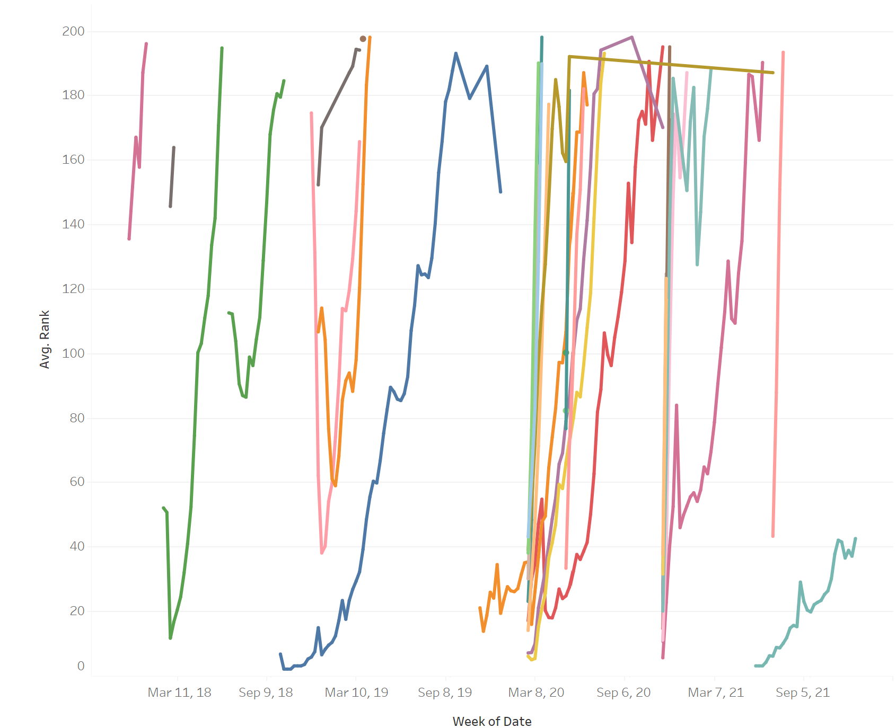
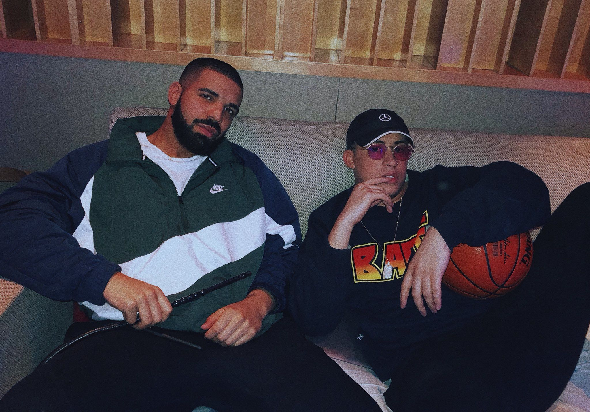

# EDA OF BadBunny: Song Performance on Spotify's Top 200

  

## Background
BadBunny is a Puerto Rican rapper who has gained global success as a rapper. As a fan I wanted to explore his song performance overtime.  
Some questions I explored included:
- How long does will a BadBunny song stay on the Top 200?
- What BadBunny songs have globally performed the best?
- What are BadBunny's top 3 performing songs?

## The Data
The data comes from Kaggle and features Spotify song data from 2017-2021 : https://www.kaggle.com/datasets/dhruvildave/spotify-charts/code  
Alperen Karan's notebook was a helpful resource as a did my analysis: https://www.kaggle.com/code/alperenkaran/spotify-top50-charts-analysis/notebook?scriptVersionId=88893676

## The Findings
- BadBunny's performs best in Spanish speaking countries (shocking! I know).
- Yonaguni is BadBunny's most streamed and highest ranking single globally :cherry_blossom:. 
- Most BadBunny songs will be on Spotify's Top200 for 1-20 days.
  - MIA (feat. BadBunny) was on the Top 200 for 362 days (almost a year)
### Which Got me thinking about MIA (feat. Drake)...
Looking at MIA (feat. Drake) rank averages and it turns out this song acted as BadBunny's crossover hit. 
This paticular viz was created in Tableau Public and you can explore it more by [clicking here.](https://public.tableau.com/app/profile/catharine.romero/viz/EDA_BADBUNNY/Dashboard2) 
The blue line in the middle is MIA (feat.Drake) and what follows in orange is Vete, which led up to the release of BadBunny's YHLQMDLG. 
Globally, MIA (feat. Drake) seems to have acted as the single that introduced BadBunny to a global audience. Prior to the songs release most BadBunny songs didn't feature the Top200. However, Drakes wider audience could have introduced more listners to BadBunny and BadBunny was able to retain that new audience. BadBunny no longers needs features to get his songs featured as on the list, per Yonaguni's global success. 
 
## Thank you! 

